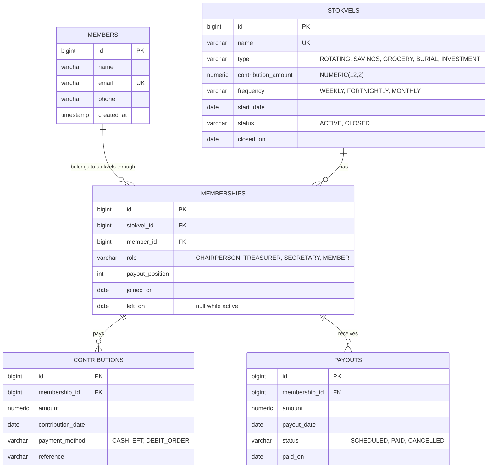

# StokVault

StokVault manages **stokvels**, the informal savings groups common in South Africa. It covers who belongs to each
stokvel, the money they pay in, the payouts they receive, and who is behind on payments.

It's a Jakarta EE 11 backend (DICT312 coursework) built only on standard Jakarta EE: **JAX-RS, CDI, EJB, JPA,
Bean Validation and JSON-B**. There's no Spring. It runs on **Payara Server 7**, stores its data in **PostgreSQL**, and
includes a small dashboard at `/stokvault/` that uses the same REST API.

| | URL (on this machine) |
|---|---|
| Dashboard | http://localhost:8081/stokvault/ |
| REST API | http://localhost:8081/stokvault/api |
| Health check | http://localhost:8081/stokvault/api/health |
| Payara admin console | http://localhost:4848 |

> **Why port 8081?** On this machine, the EDB PostgreSQL installer added a web server (the `PEMHTTPD-x64` service)
> that already uses 8080. Payara's HTTP listener was moved to 8081 in `domain1\config\domain.xml`.

---

## What it does

- **Members.** Register people once; the same person can belong to several stokvels.
- **Stokvels.** Each has a type (rotating, savings, grocery, burial, investment), a contribution amount, a
  frequency (weekly, fortnightly, monthly) and a start date. A stokvel can be closed and reopened.
- **Memberships.** A member's role in a stokvel (chairperson, treasurer, secretary or member), their place in the
  payout order, and when they joined or left.
- **Contributions.** Money paid in, with the date, payment method (cash, EFT, debit order) and a reference.
- **Payouts.** Money paid out. A payout is first *scheduled*, then either *paid* or *cancelled*.
- **Reports.** For each stokvel: the balance, totals, and every member's standing (paid in, expected by today,
  arrears, received). For rotating stokvels, whose turn it is next and the suggested amount.

### Business rules (enforced by the server)

| Rule | Response when broken |
|---|---|
| Member emails and stokvel names are unique (not case-sensitive) | 409 |
| A stokvel has at most one active chairperson, treasurer and secretary | 409 |
| A member can't join the same stokvel twice; someone who left and rejoins goes to the back of the payout order | 409 |
| Only active members of an **active** (not closed) stokvel can contribute or be scheduled a payout | 404 / 409 |
| A contribution can't be dated before the stokvel's start date, or in the future | 409 / 400 |
| A payout can only be marked paid if the stokvel's **balance** covers it (the stokvel row is locked while this is checked) | 409 "Insufficient funds" |
| Only scheduled payouts can be paid or cancelled | 409 |
| A contribution can't be deleted once its money has been paid out (the balance would go negative) | 409 |
| A member with a scheduled payout can't leave; a stokvel with scheduled payouts can't be closed | 409 |
| A stokvel or member with financial history can't be deleted: close the stokvel / keep the member instead | 409 |
| Every request body is validated (required fields, email format, positive amounts, at most 2 decimals...) | 400 with a list of problems |

**How arrears are calculated.** Contributions fall due from the later of the stokvel's start date and the member's
join date. The first is due on that date, then one every week, fortnight or month, up to today (or until the member
left or the stokvel closed). *Expected* = contribution amount × payments due. *Arrears* = expected − paid in since
joining, and never goes below 0.

**How the payout rotation works.** The next recipient is the active member with the fewest payouts so far
(scheduled or paid; cancelled payouts don't count). Ties go to the lowest payout position. When everyone has had a
turn, the counts are equal again and the next cycle starts from position 1. The suggested amount is the "pot": one
contribution from every active member.

---

## Architecture

```
HTTP (JSON)
   │
   ▼
resource/   JAX-RS classes (@Path). Handle HTTP only: read the request, call a service, return a DTO.
   │        Bodies are validated with @Valid before the method runs.
   ▼
service/    @Stateless EJBs. All business rules. Each call runs in one database transaction.
   │
   ▼
entity/     JPA @Entity classes, mapped to PostgreSQL tables by EclipseLink (Payara's JPA provider).

dto/        Records for request and response JSON. Entities are never sent to clients directly.
domain/     Enums and plain-Java calculations (arrears, rotation), unit tested without a server.
exception/  Exceptions, plus ExceptionMappers that turn every error into the same JSON shape.
config/     JAX-RS setup (/api), CORS, and conversion of dates in the URL.
webapp/     The dashboard (HTML, CSS, JS) and WEB-INF/beans.xml, which switches on CDI.
```

### Data model



Contributions and payouts point at a **membership**, not directly at a member. That guarantees the payer or
recipient really belongs to that stokvel. Leaving a stokvel sets `left_on` instead of deleting the row, so the
history stays intact.

### Where each Jakarta EE feature is used

| Feature | Where |
|---|---|
| JAX-RS `@Path`, `@GET/@POST/@PUT/@DELETE`, `@PathParam`, `@QueryParam` | `resource/*Resource.java` |
| JAX-RS `ExceptionMapper`, `ContainerResponseFilter`, `ParamConverterProvider` | `exception/*Mapper.java`, `config/CorsFilter.java`, `config/LocalDateParamConverterProvider.java` |
| CDI `@Inject` (enabled by `beans.xml`) | resources → services, services → services |
| EJB `@Stateless`, container-managed transactions, `@TransactionAttribute`, `@ApplicationException` | `service/`, `exception/` |
| JPA `@Entity`, `@ManyToOne`, `@SequenceGenerator`, `@Enumerated`, `@PrePersist`, JPQL, aggregates, `GROUP BY`, pessimistic locking | `entity/`, `service/` |
| Bean Validation `@NotBlank`, `@Email`, `@Positive`, `@Digits`, `@PastOrPresent`, `@Pattern`, `@Valid` | `dto/*Request.java`, `entity/` |
| JSON-B (automatic JSON for records, enums, `LocalDate`, `BigDecimal`) | every resource |
| JNDI data source `jdbc/StokVaultDS` | `persistence.xml` + Payara connection pool |

---

## API reference

All paths are relative to `http://localhost:8081/stokvault/api`. Bodies are JSON. Dates look like `2026-09-28`, and
amounts are in rand with up to 2 decimals.

### Members

| Method | Path | Notes |
|---|---|---|
| GET | `/members?search=tha` | `search` is optional; it matches name or email |
| GET | `/members/{id}` | |
| POST | `/members` | `{"name":"Thandi Mokoena","email":"thandi@example.com","phone":"082 123 4567"}` → 201 |
| PUT | `/members/{id}` | same body as POST |
| DELETE | `/members/{id}` | 204; 409 if they've ever joined a stokvel |
| GET | `/members/{id}/memberships` | the stokvels they belong (or belonged) to |

### Stokvels

| Method | Path | Notes |
|---|---|---|
| GET | `/stokvels?status=ACTIVE` | `status` is optional |
| GET | `/stokvels/{id}` | |
| POST | `/stokvels` | `{"name":"Ubuntu Savings Club","type":"ROTATING","contributionAmount":500,"frequency":"MONTHLY","startDate":"2026-06-01","description":"..."}` |
| PUT | `/stokvels/{id}` | same body as POST |
| DELETE | `/stokvels/{id}` | only if it has no contributions or payouts |
| POST | `/stokvels/{id}/close` | no body; refused while payouts are scheduled |
| POST | `/stokvels/{id}/reopen` | no body |
| GET | `/stokvels/{id}/summary` | balance, totals, and each member's paid / expected / arrears / received |

### Members of a stokvel

| Method | Path | Notes |
|---|---|---|
| GET | `/stokvels/{id}/members?includeInactive=true` | in payout order; `includeInactive` also lists members who left |
| GET | `/stokvels/{id}/members/{memberId}` | |
| POST | `/stokvels/{id}/members` | `{"memberId":3,"role":"TREASURER","joinedOn":"2026-06-01"}`; `role` and `joinedOn` are optional |
| PUT | `/stokvels/{id}/members/{memberId}` | `{"role":"SECRETARY"}` and/or `{"payoutPosition":2}`; taking someone's position swaps the two members |
| DELETE | `/stokvels/{id}/members/{memberId}` | the member leaves (their history is kept) |

### Contributions

| Method | Path | Notes |
|---|---|---|
| GET | `/stokvels/{id}/contributions?memberId=3&from=2026-06-01&to=2026-08-31` | all filters optional; newest first |
| GET | `/stokvels/{id}/contributions/{contributionId}` | |
| POST | `/stokvels/{id}/contributions` | `{"memberId":3,"amount":500,"contributionDate":"2026-09-01","paymentMethod":"EFT","reference":"SEP-3"}`; date defaults to today, method to CASH |
| DELETE | `/stokvels/{id}/contributions/{contributionId}` | to correct mistakes; refused once the money has been paid out |

### Payouts

| Method | Path | Notes |
|---|---|---|
| GET | `/stokvels/{id}/payouts?status=SCHEDULED` | `status` is optional |
| GET | `/stokvels/{id}/payouts/next` | rotating stokvels only: `{"memberName":"...","payoutPosition":4,"suggestedAmount":2500.00,...}` |
| GET | `/stokvels/{id}/payouts/{payoutId}` | |
| POST | `/stokvels/{id}/payouts` | `{"memberId":4,"amount":2500,"payoutDate":"2026-09-30","notes":"..."}` → SCHEDULED |
| POST | `/stokvels/{id}/payouts/{payoutId}/pay` | → PAID, or 409 if the balance is too low |
| POST | `/stokvels/{id}/payouts/{payoutId}/cancel` | → CANCELLED |

### Health

`GET /health` returns `{"status":"ok","database":"up"}`, or **503** with `"database":"down"` if PostgreSQL can't be reached.

### Errors

Every error has the same JSON shape:

```json
{
  "status": 409,
  "error": "Conflict",
  "message": "Insufficient funds: the balance is R1750.00 but this payout is R2500.00",
  "details": []
}
```

For validation errors (400), `details` lists each problem, e.g. `"email: must be a well-formed email address"`.

---

## Setup

### 1. PostgreSQL

Install PostgreSQL 18 from <https://www.postgresql.org/download/windows/> (keep port 5432, and keep pgAdmin 4 selected).
Then open pgAdmin, select the **postgres** database, choose **Tools → Query Tool**, and run these lines **one at a
time** (highlight a line, press F5):

```sql
CREATE USER stokvault WITH PASSWORD 'choose-a-password';
CREATE DATABASE stokvault OWNER stokvault;
```

Payara doesn't create the database itself, but the app creates all the **tables** on its first deploy.

<details>
<summary>Forgot the <code>postgres</code> password?</summary>

PostgreSQL has no way to show an existing password. You can only set a new one.

- **Not installed any more:** rename any old `C:\Program Files\PostgreSQL\18\data` folder to `data.old`, then reinstall
  and choose a new password.
- **Installed and running:** as Administrator, edit `C:\Program Files\PostgreSQL\18\data\pg_hba.conf`. On the
  `127.0.0.1/32` and `::1/128` lines, change `scram-sha-256` to `trust`, then run `Restart-Service postgresql-x64-18`.
  Connect with `psql -U postgres -h localhost` and run `ALTER USER postgres WITH PASSWORD 'new-password';`.
  **Then change `trust` back** and restart again.
- **Forgot the `stokvault` user's password:** as `postgres`, run `ALTER USER stokvault WITH PASSWORD '...';`, then update Payara:
  `asadmin set resources.jdbc-connection-pool.StokVaultPool.property.password=...`

</details>

### 2. Payara (one time)

Payara 7 needs **JDK 21 or newer**. On JDK 17 you get `UnsupportedClassVersionError ... class file version 65.0`.
The last line of `payara7\glassfish\config\asenv.bat` pins Payara to JDK 21, whatever `java` is on your PATH:

```
set AS_JAVA=C:\Program Files\Eclipse Adoptium\jdk-21.0.8.9-hotspot
```

Run these in Command Prompt from `C:\Users\jaget\OneDrive\Documents\payara7\bin`:

```bash
asadmin start-domain domain1

# Give Payara the PostgreSQL JDBC driver (Maven has already downloaded it)
asadmin add-library "%USERPROFILE%\.m2\repository\org\postgresql\postgresql\42.7.7\postgresql-42.7.7.jar"
asadmin restart-domain domain1

# The connection pool (driver class org.postgresql.ds.PGSimpleDataSource) and its JNDI name
asadmin create-jdbc-connection-pool --datasourceclassname org.postgresql.ds.PGSimpleDataSource --restype javax.sql.DataSource --property "user=stokvault:password=choose-a-password:serverName=localhost:portNumber=5432:databaseName=stokvault" StokVaultPool
asadmin create-jdbc-resource --connectionpoolid StokVaultPool jdbc/StokVaultDS

# Expect "Command ping-connection-pool executed successfully."
asadmin ping-connection-pool StokVaultPool
```

In `--property`, `:` separates the settings, so write a `:` inside the password as `\:`.

### 3. Build and deploy

```bash
mvn clean package
copy target\stokvault.war "C:\Users\jaget\OneDrive\Documents\payara7\glassfish\domains\domain1\autodeploy"
```

`mvn clean package` compiles the code, runs the unit tests, and produces `target\stokvault.war`. In IntelliJ you
can use the Maven tool window instead: **Lifecycle → clean**, then **package**. Within a few seconds a
`stokvault.war_deployed` file appears in `autodeploy`. If you get `stokvault.war_deployFailed` instead, the reason is
in `domain1\logs\server.log`. Deploy again after every code change; Payara replaces the old version.

### 4. Demo data and tests

From the project folder, in PowerShell:

```bash
powershell -ExecutionPolicy Bypass -File scripts\seed-demo-data.ps1
```

This loads two stokvels through the API:

- **Ubuntu Savings Club:** rotating, R500 a month, 5 members, 3 paid rotations. Two members are behind, so the
  September payout can't be paid yet.
- **Kasi December Grocery:** R300 a month since January, 4 members.

The script does nothing if the data is already there.

```bash
powershell -ExecutionPolicy Bypass -File scripts\api-tests.ps1
```

This runs **36 end-to-end checks** against the running server: status codes, validation, every business rule and
the report totals. The rule checks are refused requests, so they change nothing, and anything the script creates it
deletes again. It needs the demo data.

Unit tests for the arrears and rotation calculations (`src/test/java`) run automatically with `mvn package`, or on
their own with `mvn test`.

---

## Notes and troubleshooting

- **Tables and columns are managed by EclipseLink** (`eclipselink.ddl-generation = create-or-extend-tables` in
  `persistence.xml`). New entities get tables and new fields get columns on redeploy. Renamed or retyped fields are
  **not** migrated: fix those by hand with `ALTER TABLE` in pgAdmin. Warnings like
  `relation "members_id_seq" already exists` in `server.log` are harmless.
- **Ids come from sequences** (`@SequenceGenerator`), not `IDENTITY`. EclipseLink generates invalid SQL
  (`BIGINT SERIAL`) for IDENTITY on PostgreSQL.
- **Resetting all data:** in pgAdmin's Query Tool on the **stokvault** database, run
  `DROP TABLE payouts, contributions, memberships, stokvels, members CASCADE;` and redeploy. The tables come back empty.
- **OneDrive:** Payara lives in a OneDrive folder. If deploys fail with locked-file errors, pause OneDrive syncing or
  move `payara7` to a folder outside OneDrive, such as `C:\payara7`.

## Possible next steps

- **Authentication and roles** with Jakarta Security, e.g. `@RolesAllowed("TREASURER")` on the payout endpoints,
  so that only office-bearers can move money.
- **Arquillian integration tests** that deploy the WAR to an embedded Payara during `mvn verify`.
- **An audit trail** of who recorded or changed each contribution.
