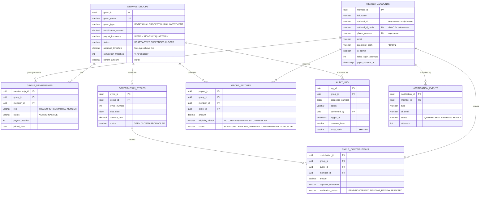
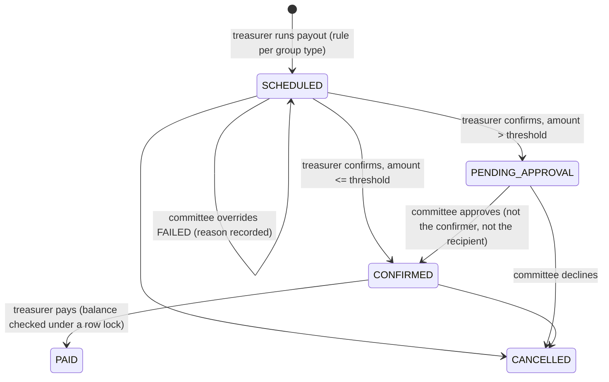

<p align="center"></p>

# StokVault

**A transparent contribution and payout management platform for stokvels**, built on **Jakarta EE 11**
for the Centre for Entrepreneurship, Cooperatives & Innovation (UMP). DICT312, Group GR5, Sizanani Digital Solutions.

StokVault replaces WhatsApp and notebook record-keeping with one auditable system:

- **Contributions.** The treasurer records and verifies them against scheduled cycles.
- **Payouts.** The group type's rules plan them, an automated batch job checks eligibility, and high-value payouts need
  a second person's approval.
- **Audit trail.** Every financial action is written to a **hash-chained, tamper-evident audit log**.
- **Notifications.** Members get SMS/WhatsApp messages through an asynchronous **JMS queue**.

This implementation follows **`StokVault_SDD_Proposal2.docx` (SDD v2.0)**. Every part is built with standard Jakarta EE
specifications on **Payara Server 7** and **PostgreSQL**.

| | URL (this machine) |
|---|---|
| Web app (Jakarta Faces) | http://localhost:8081/stokvault/ |
| REST API (Jakarta REST) | http://localhost:8081/stokvault/api |
| Health check | http://localhost:8081/stokvault/api/health |
| Payara admin console | http://localhost:4848 |

---

## Contents

1. [How the SDD maps to the code](#1-how-the-sdd-maps-to-the-code)
2. [Running it locally](#2-running-it-locally)
3. [Demo data and accounts](#3-demo-data-and-accounts)
4. [Using the app, by role](#4-using-the-app-by-role)
5. [Architecture](#5-architecture)
6. [Business rules](#6-business-rules)
7. [REST API](#7-rest-api)
8. [Security](#8-security)
9. [Testing](#9-testing)
10. [Deployment: Docker and CI](#10-deployment-docker-and-ci)
11. [Differences from the SDD](#11-differences-from-the-sdd)
12. [Troubleshooting](#12-troubleshooting)

---

## 1. How the SDD maps to the code

| SDD | Requirement | Jakarta EE technology | Where |
|---|---|---|---|
| 2.3, 3.1 | Layered monolith, one WAR on Payara | Faces, REST, EJB, CDI, JPA | whole project |
| 3.2, 4.1 | Group management, one treasurer per group, DRAFT/ACTIVE/SUSPENDED/CLOSED | EJB, JPA | `service/GroupService`, `service/MembershipService` |
| 4.1, 4.3 | Payout rule **strategy pattern** per stokvel type | plain Java | `domain/rules/*PayoutRule` |
| 4.2 | Contributions per cycle; PENDING / VERIFIED / PENDING_REVIEW / REJECTED; idempotency | EJB, JPA, Bean Validation | `service/ContributionService`, `service/CycleService` |
| 4.3 | **Automated payout eligibility check** | **Jakarta Batch** (chunk job), EJB timer | `batch/*`, `META-INF/batch-jobs/payout-eligibility.xml` |
| 4.3 | Four-eyes approval above a threshold; committee override with reason | EJB | `service/PayoutService` |
| 4.4 | **Asynchronous notifications**: CDI event, then JMS queue, then message-driven bean; retries, email fallback, dead-letter queue | **CDI events, Jakarta Messaging, MDB, Jakarta Mail** | `notification/*` |
| 3.1 | Background reminder scheduling | **Jakarta Concurrency** | `notification/ReminderScheduler` |
| 4.5 | **Hash-chained, append-only audit log** in the same transaction; chain verification | JPA, JTA, PostgreSQL trigger | `audit/AuditService`, `domain/HashChain`, `config/StartupTasks` |
| 4.5 | PDF / CSV statements | Jakarta REST | `report/*`, `resource/ReportResource` |
| 4.6, 7.1 | Login by phone + password or **SMS one-time code**; lockout after 5 failures | **Jakarta Security** (`HttpAuthenticationMechanism` + JPA `IdentityStore`) | `security/*`, `service/AuthService` |
| 7.2 | RBAC with **per-group roles**; tenant isolation | `@RolesAllowed`, `SecurityContext` | `security/AccessControl`, every service |
| 7.3 | National ID encrypted at rest (AES-256); hashed passwords | JPA `AttributeConverter`, `Pbkdf2PasswordHash` | `security/FieldCrypto`, `security/PasswordHasher` |
| 7.4 | POPIA consent at registration | Bean Validation | `dto/MemberRegistration` |
| 5.1, 5.2 | Data model with UUID keys | JPA | `entity/*` |
| 6.1 | Treasurer, Committee, Member and Admin dashboards; mobile-first | **Jakarta Faces** (Facelets) | `webapp/app/*.xhtml`, `web/*` |
| 6.2 | JSON API for the mobile web client | Jakarta REST, JSON-B | `resource/*` |
| 8.3, 8.4 | Financial data never cached; indexes on (group, cycle) and member | JPA | `persistence.xml`, entity `@Index`es |
| 9.2 | CI: build and tests on every push | GitHub Actions + Maven | `.github/workflows/build.yml` |
| 9.4 | Docker image wrapping Payara and the WAR | Docker | `docker/`, `docker-compose.yml` |
| 10.1 | JUnit 5, coverage measured with JaCoCo | JUnit, JaCoCo | `src/test/java` |

Section 11 lists where this build differs from the SDD, and why.

---

## 2. Running it locally

Requirements: **JDK 21** (Payara 7 needs 21+), **PostgreSQL 18**, **Payara Server 7**, and **Maven**. IntelliJ has
Maven built in.

### 2.1 PostgreSQL

In pgAdmin, select the **postgres** database, choose **Tools → Query Tool**, and run these lines **one at a time**
(highlight a line, then press F5):

```sql
CREATE USER stokvault WITH PASSWORD 'choose-a-password';
CREATE DATABASE stokvault OWNER stokvault;
```

The app creates all its tables on the first deploy.

### 2.2 Payara (one time)

Payara must run on JDK 21. On this machine the last line of `payara7\glassfish\config\asenv.bat` is
`set AS_JAVA=C:\Program Files\Eclipse Adoptium\jdk-21.0.8.9-hotspot`. Payara's HTTP port was moved to **8081**,
because a PostgreSQL helper service (`PEMHTTPD-x64`) already uses 8080.

Run these in Command Prompt from `C:\Users\jaget\OneDrive\Documents\payara7\bin`:

```bash
asadmin start-domain domain1
asadmin add-library "%USERPROFILE%\.m2\repository\org\postgresql\postgresql\42.7.7\postgresql-42.7.7.jar"
asadmin restart-domain domain1
asadmin create-jdbc-connection-pool --datasourceclassname org.postgresql.ds.PGSimpleDataSource --restype javax.sql.DataSource --property "user=stokvault:password=choose-a-password:serverName=localhost:portNumber=5432:databaseName=stokvault:stringtype=unspecified" StokVaultPool
asadmin create-jdbc-resource --connectionpoolid StokVaultPool jdbc/StokVaultDS
asadmin ping-connection-pool StokVaultPool
```

- `stringtype=unspecified` is **required**. Without it, PostgreSQL rejects the `NULL` values EclipseLink sends for
  optional UUID columns. To add it to an existing pool:
  `asadmin set resources.jdbc-connection-pool.StokVaultPool.property.stringtype=unspecified`
- If the password contains a `:`, write it as `\:` inside `--property`.

### 2.3 Build and deploy

```bash
mvn clean package
copy target\stokvault.war "C:\Users\jaget\OneDrive\Documents\payara7\glassfish\domains\domain1\autodeploy"
```

`mvn clean package` compiles the code, runs the 49 unit tests and builds `target\stokvault.war`. Within a few seconds
`stokvault.war_deployed` appears in `autodeploy`. If `stokvault.war_deployFailed` appears instead, the reason is in
`domains\domain1\logs\server.log`.

### 2.4 The first administrator

On first start StokVault creates a **Coop Office administrator** with phone number **060 000 0000**. Its random
password is printed **once** in `server.log`:

```bash
findstr /C:"generated password" "C:\Users\jaget\OneDrive\Documents\payara7\glassfish\domains\domain1\logs\server.log*"
```

Log in and change it under **My account**. To choose the credentials yourself instead, set them before the first
start with `asadmin create-system-properties stokvault.admin.phone=...:stokvault.admin.password=...`.

---

## 3. Demo data and accounts

```bash
powershell -ExecutionPolicy Bypass -File scripts\seed-demo-data.ps1
```

This builds three stokvels entirely through the API. Each demo member signs in once with an SMS code, which the
script reads from the simulated gateway's log, and then sets a password:

| Stokvel | Type | What it shows |
|---|---|---|
| **Ubuntu Savings Club** | Rotational, R500/month | Cycles 1–3 paid out in rotation, each approved by a committee member (four-eyes). In open cycle 4, one member hasn't paid, one paid short (flagged *pending review*), and the payout **failed** its automated eligibility check. |
| **Kasi December Grocery** | Grocery, R300/month | 9 cycles, 8 of them reconciled; one member is two months in arrears. |
| **Siyakhana Burial Society** | Burial, R150/month | A funeral claim that **passed** the eligibility check and is confirmed, ready to pay. |

**Demo accounts** (password `Demo-2026`, for demos only):

| Person | Phone | Roles |
|---|---|---|
| Thandi Mokoena | 082 123 4567 | **Treasurer** of Ubuntu; member of Grocery |
| Sipho Dlamini | 083 234 5678 | **Committee** in Ubuntu; **treasurer** of Burial |
| Lerato Nkosi | 071 345 6789 | Committee in Ubuntu |
| Naledi Mahlangu | 084 567 8901 | Member of Ubuntu (WhatsApp); committee in Burial |
| Bongani Khumalo | 072 456 7890 | Plain member (Ubuntu, Burial) |
| Zanele Ndlovu | 076 678 9012 | Treasurer of Grocery |
| Kagiso Molefe | 079 789 0123 | Committee in Grocery |
| Ayanda Zulu | 061 890 1234 | Member (Grocery, Burial) |

The same person has different roles in different stokvels (SDD 7.2). Log in as each of them to see how the screens
change.

---

## 4. Using the app, by role

| Page | Who | What |
|---|---|---|
| **Log in** | everyone | Phone number and password, or **"Text me a login code"**. New members use a code the first time, then choose a password. |
| **My stokvels** | everyone | For each group: what I've paid, my arrears, what I've received, whether the current cycle is paid, and for rotational groups **my place in the queue and the estimated date of my payout**. |
| Group → **Overview** | everyone | Balance, the current cycle, standings (officers see every member; members only themselves), statement downloads, and "I've paid" to report a payment. |
| Group → **Contributions** | treasurer | Open, close and reconcile cycles; the **"who has paid" grid**; record payments; **verify or reject** flagged ones. |
| Group → **Payouts** | treasurer / committee | **Initiate a payout** (the rule depends on the group type), see the automated eligibility result, confirm, **approve** (committee), **override** a failed check with a reason (committee), mark paid, cancel. |
| Group → **Members** | officers | Find people by phone or ID number, register new people (with POPIA consent), set roles and payout order, remove members. |
| Group → **Audit & reports** | officers | The audit trail with its **chain-verification result**; group statements and audit trail as PDF or CSV. |
| Group → **Settings** | treasurer / admin | Contribution amount, frequency, approval threshold, required completion %, burial benefit; activate, suspend, resume or close the group. |
| **Approvals** | committee | High-value payouts waiting for a second person, across all of their groups. |
| **Coop Office** | admin | Platform-wide figures and audit status for every group, registering groups and people, the notification log (including dead-lettered messages), and running jobs on demand. |
| **My account** | everyone | Password, contact details, preferred channel (SMS/WhatsApp), and the messages sent to me. |

The pages only show buttons a user is allowed to use. The services check every rule again, so hiding a button is
never the security boundary.

**Design.** The UI follows the StokVault design reference (`StokVault App.dc.html`):

- Archivo typeface and the brand palette
- A sidebar with the current group and section navigation
- A deep-green "collection" hero with a progress bar
- Status pills and initial avatars
- A cycle-by-cycle contribution grid (paid / paid late / part paid / awaiting verification / outstanding)
- The rotation list with the next recipient highlighted
- A "Record payment" dialog with toasts for results

**Hide amounts** masks every rand value on screen, for projecting at a meeting. It's pure Jakarta Faces, with one
small script (`resources/js/stokvault.js`) for the dialog, toasts and that toggle. Every member of a group can see
who has paid the current cycle, as the design shows; payment references and full records stay with the officers.

---

## 5. Architecture

```
Browser (Faces pages)           Mobile / scripts (JSON)
        │                                │
   web/*Bean  (@Named, @ViewScoped)   resource/*Resource  (@Path)       ◄─ presentation / service tier
        └────────────────┬───────────────┘
                         ▼
   service/*Service  (@Stateless EJB, @RolesAllowed, JTA transaction per call)   ◄─ business logic tier
      │   uses: security/AccessControl (per-group roles), domain/* (rules, eligibility,
      │         hash chain), audit/AuditService (same transaction), CDI events for notifications
      ▼
   entity/*  (JPA, EclipseLink) ──► PostgreSQL                                  ◄─ persistence tier

   Background:  batch/ (Jakarta Batch eligibility job, EJB @Schedule 06:00)
                notification/ (JMS queue → MDB → SMS/WhatsApp/email; Concurrency reminders 08:00)
```

| Package | Contents |
|---|---|
| `domain` | Enums, and business logic in plain Java that is unit tested without a server: `Eligibility`, `HashChain`, `SaIdNumber`, `PhoneNumbers`, `Money`, and `rules/` (payout strategies). |
| `entity` | JPA entities from SDD 5.2. |
| `service` | `@Stateless` EJBs holding the business rules. |
| `security` | Authentication mechanism, identity store, per-group access control, field encryption, password hashing. |
| `audit` | Hash-chained audit log. |
| `notification` | JMS outbox, message-driven bean, gateways, reminders. |
| `batch` | Payout eligibility job (reader, processor, writer), triggers. |
| `report` | Statement model, and the CSV and PDF writers. |
| `resource` | REST endpoints. |
| `web` | Faces backing beans. |
| `dto` | JSON / view records. |
| `exception` | Exceptions and error mapping. |
| `config` | JAX-RS activation, startup tasks. |

### Data model



### Contribution data flow (SDD 3.4)

1. The treasurer submits a payment on the Faces page, or a client POSTs to `/api/groups/{id}/contributions`.
2. Jakarta Security authenticates the caller; `AccessControl` checks their role **in this group**.
3. `ContributionService` (EJB, JTA transaction) validates the payment, sets its verification status and persists it.
4. `AuditService` appends a hash-chained entry **in the same transaction**.
5. A CDI `NotificationRequest` event is observed, and a JMS message is sent. The message is also part of the
   transaction, so it's only delivered if everything commits.
6. The transaction commits. On any failure everything rolls back, so there's no half-recorded payment and no audit
   entry without a change.
7. Later, independently, the `NotificationDispatcher` MDB delivers the SMS or WhatsApp message.

### Payout lifecycle (SDD 4.3)



---

## 6. Business rules

**Groups and members**
- A group starts as **DRAFT** and becomes **ACTIVE** once it has a treasurer. It can be **SUSPENDED** by the committee
  or an admin, and only an admin can resume or close it. Only an ACTIVE group moves money.
- **One active treasurer per group.** Appointing a new one moves the old treasurer to the committee.
- While a cycle is open, only a **committee member** (or an admin) can add members.
- Members who leave become INACTIVE and their history is kept. Nobody can leave with a payout in progress, and the
  treasurer can't be removed.
- Phone numbers and ID numbers are unique. ID numbers are validated (date of birth and Luhn check digit).

**Contributions (SDD 4.2)**
- They are recorded against the **open** cycle. The amount due is copied into the cycle when it opens.
- **Treasurer-recorded** payments are VERIFIED straight away, unless the **amount differs** from what's still due or
  the **payment reference was already used**. Those are flagged **PENDING_REVIEW** instead of being rejected.
- **Self-reported** payments, including the treasurer's own, are PENDING until another officer verifies them.
  **Nobody verifies their own contribution.** Rejecting needs a reason.
- Resubmitting the same (member, cycle, reference) returns the existing record (**idempotent**).
- Only VERIFIED money counts. **Balance** = verified contributions − paid payouts. **Arrears** = for each cycle due
  since joining: amount due − verified.
- A cycle can only be **reconciled** after it's closed and every contribution is verified or rejected.

**Payouts (SDD 4.3)**
- **Rules by group type:**
  - *Rotational:* the cycle's verified collection goes to whoever has had the fewest payouts; ties go to the lowest
    position.
  - *Grocery:* the pool is split equally.
  - *Burial:* the configured benefit is paid to the member named in the claim.
  - *Investment:* pro rata to each member's verified contributions.
- **Automated eligibility check** (Jakarta Batch): all of the following must hold, and every failing condition is
  listed.
  - the group is ACTIVE
  - the recipient is ACTIVE
  - the cycle's completion is at least the group's threshold
  - no contributions await verification
  - the balance covers the payout
- A payout can't be confirmed until the check has **PASSED**, or a committee member has **OVERRIDDEN** a failure with
  a reason.
- **Four-eyes:** above the approval threshold, a committee member must approve. The approver can't be the treasurer
  who confirmed it or the recipient.
- Paying locks the group row (`SELECT … FOR UPDATE`), so two payments can't spend the same balance.

---

## 7. REST API

The base URL is `http://localhost:8081/stokvault/api`. The API speaks JSON, and ids are UUIDs.

**Authentication:** `Authorization: Basic base64(phone:password)`, or `Authorization: OTP base64(phone:code)` after
`POST /auth/login-code`. Errors always have the shape
`{"status":409,"error":"Conflict","message":"...","details":[...]}` (401, 403, 404, 400 with field details, 409).

| Area | Endpoints |
|---|---|
| Public | `GET /health` · `POST /auth/login-code {"phoneNumber"}` |
| Me | `GET /me` (member and roles) · `GET /me/positions` (member dashboard) · `GET /me/notifications` · `PUT /me/password {"currentPassword","newPassword"}` |
| People | `GET /members?q=` · `POST /members` (register: `fullName, nationalId, phoneNumber, email, preferredChannel, popiaConsent`) · `GET/PUT /members/{id}` · `GET /members/{id}/memberships` |
| Groups | `GET /groups` · `POST /groups` (admin) · `GET/PUT /groups/{id}` · `POST /groups/{id}/activate · /suspend · /resume · /close` (optional `{"reason"}`) · `GET /groups/{id}/summary` |
| Members of a group | `GET /groups/{id}/members?includeInactive=` · `POST … {"memberId","role","joinedDate"}` · `PUT …/{memberId} {"role"} / {"payoutPosition"}` · `DELETE …/{memberId}` |
| Cycles | `GET /groups/{id}/cycles` · `POST /groups/{id}/cycles?dueDate=` · `GET …/{cycleId}/grid` · `POST …/{cycleId}/close · /reconcile` |
| Contributions | `GET /groups/{id}/contributions?cycleId=&memberId=&status=` · `POST … {"memberId","amount","paymentReference","paymentMethod","contributionDate"}` (201 new / 200 duplicate) · `POST …/{cid}/verify {"decision":"VERIFIED"\|"REJECTED","note"}` |
| Payouts | `GET /groups/{id}/payouts?status=` · `POST …/run` (optional `{"cycleId"}` / `{"beneficiaryMemberId"}` / `{"amountToDistribute"}`) · `POST …/eligibility-check` (202, batch job) · `POST …/{pid}/confirm · /approve · /pay` · `POST …/{pid}/override {"reason"}` · `POST …/{pid}/cancel` |
| Committee | `GET /approvals` |
| Audit and reports | `GET /groups/{id}/audit?limit=` · `GET /groups/{id}/audit/verify` · `GET /groups/{id}/reports/statement?format=pdf\|csv&from=&to=` · `GET …/reports/members/{memberId}/statement` · `GET …/reports/audit` |
| Admin | `GET /admin/report` · `GET /admin/notifications?status=FAILED` · `POST /admin/jobs/eligibility` · `GET /admin/jobs/{executionId}` · `POST /admin/jobs/reminders` |

---

## 8. Security

- **Passwords and login codes** are hashed with Jakarta Security's `Pbkdf2PasswordHash` (PBKDF2-HMAC-SHA256,
  100,000 iterations, random salt).
- **Login codes** are 6 digits, valid for 5 minutes and usable once, with at most one per minute. Requesting one never
  reveals whether a number is registered.
- **Lockout:** 5 failed attempts lock an account for 15 minutes.
- **National ID numbers:**
  - stored with **AES-256-GCM** (a random IV per value, and tampering is detected);
  - uniqueness is enforced on an **HMAC** of the number;
  - only the last 4 digits are ever shown.
  - The key comes from the system property `stokvault.crypto.key` (Base64, 32 bytes) or a key file created on first
    start: `domains/domain1/config/stokvault-field.key`. **Back that file up.** Without it, the encrypted ID numbers
    can't be read.
- **Roles:** everyone is `MEMBER`; `TREASURER` / `COMMITTEE` are granted if held in any group; `ADMIN` is for the
  Coop Office. `@RolesAllowed` on the EJBs does the coarse check. `AccessControl` then checks the role **in the
  group concerned**, and anyone outside a group gets **404**, so they can't even learn that it exists.
- **Tamper-evident audit log**, protected three ways:
  - entries have no setters;
  - a PostgreSQL trigger rejects `UPDATE`/`DELETE`/`TRUNCATE`;
  - each entry's SHA-256 covers the previous entry's hash.

  **Try it:** in pgAdmin, run `ALTER TABLE audit_log DISABLE TRIGGER audit_log_no_update_or_delete;`, change the
  `details` of any entry, and open the group's **Audit & reports** tab. It shows **"AUDIT TRAIL TAMPERED WITH"** and
  the entry number. Re-enable the trigger afterwards.
- SQL injection is prevented by using only JPA parameters; every input is checked by Bean Validation; CSV exports
  neutralise spreadsheet formulas.
- **HTTPS (SDD 6.4)** is left off for local development. For staging and production, uncomment the
  `CONFIDENTIAL` transport guarantee in `web.xml` and set the session cookie to `secure`.

---

## 9. Testing

| Level | How | Result |
|---|---|---|
| **Unit** (SDD 10.1) | `mvn test`, 49 JUnit 5 tests: payout rules, eligibility, hash chain (including tampering), SA ID and phone validation, encryption, CSV/PDF | all pass; about 100% line coverage of the business-logic classes (`target/site/jacoco/index.html`) |
| **End-to-end API** | `powershell -ExecutionPolicy Bypass -File scripts\api-tests.ps1`, 48 checks against the running server: authentication, OTP, lockout, per-group roles, tenant isolation, validation, every business rule, idempotency, audit chains, exports, batch job | all pass |
| **Scenario** | `scripts\seed-demo-data.ps1` drives full payout cycles through the API, including the JMS/MDB, batch and four-eyes paths | runs clean |
| **UI** | tested manually in the browser as treasurer, committee and admin (login, verification, the rules shown as messages, exports, reminders) | – |

---

## 10. Deployment: Docker and CI

**Docker (SDD 9.4).** `docker/Dockerfile` builds the WAR (running the unit tests) and packages it on the official
`payara/server-full:7.2026.9` image. At start-up, `docker/init_0_stokvault_datasource.sh` creates the connection pool
from environment variables:

```bash
echo DB_PASSWORD=choose-a-strong-password > .env
docker compose up --build
```

This starts PostgreSQL 18 and StokVault at http://localhost:8080/stokvault/. Docker isn't installed on the
development machine, so the image is built by CI rather than tested locally.

**CI (SDD 9.2).** `.github/workflows/build.yml` runs on every push and pull request. It builds with JDK 21, runs the
unit tests, uploads the WAR and the coverage report as artifacts, and builds the Docker image.

---

## 11. Differences from the SDD

| SDD says | This build | Why |
|---|---|---|
| bcrypt password hashing | PBKDF2 (`Pbkdf2PasswordHash`) | It's the algorithm built into Jakarta Security, so no third-party library; it is similarly slow by design. |
| Jakarta Faces **+ PrimeFaces** | Plain Jakarta Faces with custom CSS | Keeps the project to pure Jakarta EE; PrimeFaces can be added later without changing the backing beans. |
| Flyway migrations | JPA/EclipseLink schema generation (`create-or-extend-tables`) | Stays within Jakarta tools. Flyway is the recommended step before production. |
| SMS / WhatsApp Business gateway | Simulated gateways that write to `server.log`; real email via Jakarta Mail when an SMTP host is configured | There are no gateway credentials for the pilot. Only `SimulatedSmsGateway` / `SimulatedWhatsAppGateway` need replacing. |
| Append-only via database role grants | A PostgreSQL trigger | The app's database user owns the tables, and an owner can't have its own grants revoked; a trigger blocks changes regardless of who runs them. |
| Table names `Member`, `Payout`... | `member_accounts`, `group_payouts`... | They avoid clashing with the v1 tables still in the database. |
| H2 for development | PostgreSQL everywhere | Development then matches production. |
| Arquillian and Selenium tests | PowerShell end-to-end API tests against a running server, and manual UI testing | Arquillian needs extra server adapters. The API tests cover the same rules end to end. |
| OTP step-up for high-value payouts; bank statement upload; proof-of-payment upload | Not implemented | Phase 2 candidates. Four-eyes approval already guards high-value payouts. |
| Auto-deploy to staging; SonarQube | CI builds and tests only | There is no staging server yet. |

---

## 12. Troubleshooting

- **Upgrading a v1 database:** v1 used the tables `members`, `memberships`, `contributions`, `payouts` and `stokvels`.
  v2 doesn't use them (it has its own tables), so they can be removed. Run this in pgAdmin on the **stokvault**
  database: `DROP TABLE IF EXISTS payouts, contributions, memberships, stokvels, members CASCADE;`
  This has already been done on the development machine.
- **`constraint ... already exists` warnings on every deploy** are harmless. EclipseLink's "create or extend" mode
  re-adds constraints and skips any that already exist.
- **`column ... is of type uuid but expression is of type character varying`**: the connection pool is missing
  `stringtype=unspecified` (see 2.2).
- **`UnsupportedClassVersionError ... 65.0`**: Payara is running on JDK 17; it needs JDK 21.
- **Deploys fail with locked files**: Payara lives in OneDrive. Pause syncing, or move `payara7` outside OneDrive.
- **OpenMQ "default admin password" warning**: harmless locally. For production, change it with `imqusermgr`.
- **Login codes while testing**: the simulated SMS gateway writes them to `server.log`
  (`[SIMULATED SMS to 082...] Your StokVault login code is ...`).
- **Test outages**: `asadmin create-system-properties stokvault.gateway.sms.down=true` makes SMS fail. Notifications
  then fall back to email, retry 3 times with back-off, and finally go to the dead-letter queue, where they show as
  FAILED in the Coop Office notification log.
