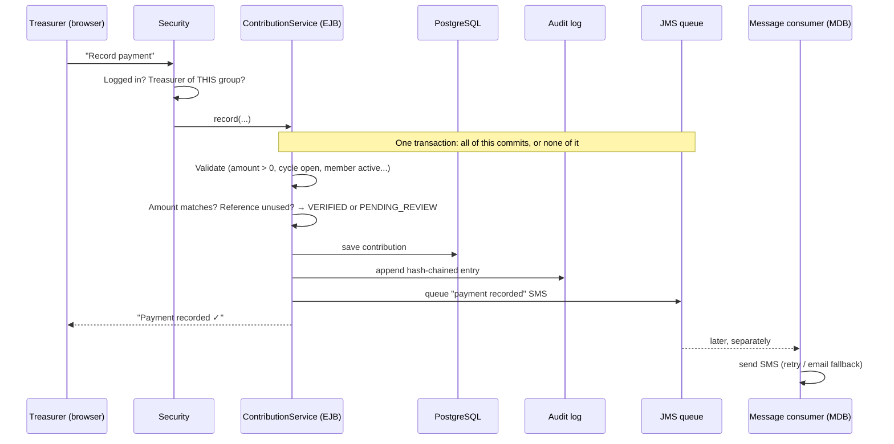

# How StokVault works: presenter's guide

**Group GR5 · Sizanani Digital Solutions · DICT312**

This guide is for presenting StokVault. It covers:

- **Part A**: what StokVault is and who uses it
- **Part B**: a demo script to click through
- **Part C**: how it works under the hood
- **Part D**: likely questions, with answers

---

## Part A: The story

### The problem (30 seconds)

Stokvels run on trust, a WhatsApp group and one person's notebook. When there's a dispute, nobody can prove who
paid what, whether a payout was fair, or whether the records were changed afterwards. The Centre for
Entrepreneurship at UMP sees these disputes again and again.

### The solution (one sentence)

> StokVault is a web platform where the **treasurer records and verifies contributions**, the **system decides
> whether a payout is allowed**, a **second person approves big payouts**, and **every action lands in an audit
> trail that can't be quietly edited**.

### Who uses it

| Role | Their questions | What they see first | Example in the demo |
|---|---|---|---|
| **Member** | Do I owe anything? How do I pay? When is my turn? | One status block with a **Pay now** button, their place in the payout line, their own payments | Bongani Khumalo |
| **Treasurer** | Who paid and needs checking? Who hasn't paid? Whose payout is ready? | A **"This month" board**: *To check*, *Not paid yet*, *Paid ✓*, and the payout's one next step | Thandi Mokoena |
| **Committee** | Is there a big payout I need to approve? | The member view, plus a **"Needs your decision"** box (approve / decline / allow anyway) | Sipho Dlamini |
| **Coop Office admin** | What do I need to register? Is every stokvel healthy? | Register a stokvel / a person first, then every stokvel, people and the message log | Admin account |

**Key point:** roles are **per group**. Thandi is treasurer of *Ubuntu Savings Club* but only a member of *Kasi
December Grocery*, so each stokvel page shows her the view for **her role in that stokvel**. That's how real
stokvels work, and the system enforces it.

**Design idea:** every screen answers *"what do I need to do right now?"* within a few seconds. Screens are
organised around **tasks**, not around database tables. Anything not needed every month is folded away under
**"More about this group"** (members) or **"Manage group"** (officers).

### The three stokvel types in the demo

| Stokvel | Type | Rule |
|---|---|---|
| Ubuntu Savings Club | Rotational, R500/month | Each month the whole pot goes to the next member in line |
| Kasi December Grocery | Grocery, R300/month | The pool is split equally at year end |
| Siyakhana Burial Society | Burial, R150/month | A fixed R1 500 is paid to a member's household when a funeral claim comes in |

(The system also supports **Investment** stokvels, which pay out in proportion to what each member put in.)

---

## Part B: Demo script (about 10 minutes)

**Before you start:**

1. PostgreSQL is running. It starts with Windows; check with `Get-Service postgresql-x64-18`.
2. Payara is running: `asadmin start-domain domain1` from `payara7\bin`.
3. http://localhost:8081/stokvault/api/health shows `"database":"up"`.
4. Every demo account's password is **`Demo-2026`**.

| Person | Phone | Use them to show |
|---|---|---|
| Thandi Mokoena | 082 123 4567 | Treasurer view |
| Sipho Dlamini | 083 234 5678 | Committee view |
| Bongani Khumalo | 072 456 7890 | Plain member view |
| Admin | 060 000 0000 | Coop Office (password in `server.log`, or the one you changed it to) |

### Step 1: Login (30 s)
Open http://localhost:8081/stokvault/
- **Say:** "Members log in with their phone number. If they forget their password, *Text me a login code* sends
  a one-time SMS code. After 5 wrong attempts the account locks for 15 minutes."

### Step 2: Home, logged in as Thandi (1 min)
- **Point at "Needs your attention":** *1 payment to check · Ubuntu Savings Club*.
- **Point at the two cards:** Thandi is *Treasurer* of Ubuntu and a plain member of Kasi. Each card has **one
  status line** ("All paid ✓ · Next payment due Thu 1 Oct") and at most one button. Unpaid stokvels would show a
  **Pay now** button and sort to the top; overdue ones turn amber.
- **Say:** "Every screen answers one question: *what do I need to do right now?* Thandi can see in three seconds
  that her own payments are done and one member's payment needs checking."

### Step 3: The treasurer's "This month" board (2 min)
Click **1 payment to check**. It opens Ubuntu Savings Club on the **This month** board.
- **The green card:** "The September round should collect R2 500. So far R2 000 is in, and 4 of 5 members have
  paid."
- **To check:** Naledi reported **R250 instead of R500**. The note says *Needs a second look: amount differs from
  the R500 due*.
- **Say:** "The system didn't reject it and didn't silently accept it. It **flagged it**. The treasurer checks the
  bank statement and either presses **Mark as paid ✓** or **Not accepted…**, which asks for a reason the member
  will see."
- **Say:** "A treasurer can never check their **own** payment. A committee member has to."
- **Not paid yet / Paid ✓:** "Anyone who hasn't paid has a **Record payment** button right next to their name.
  The people who have paid are folded away."
- **Click "Hide amounts":** "For when the screen is projected at a meeting."

### Step 4: The payout card (1.5 min)
Point at the **Payout** card on the right: Bongani, R1 000, **Checks failed: the round is 80% paid; 100% is
required; 1 payment still awaits verification.**
- **Say:** "Nobody pressed a 'check' button. As soon as a payout is planned, a **background batch job** checks it
  automatically: is the round fully paid, is anything still waiting to be checked, is the recipient still a member,
  and is there enough money? It also re-checks every payout each morning."
- **Say:** "The card only ever shows the **one next step**: plan it, confirm it, wait for the committee, or mark it
  as paid out. Here the treasurer *can't* confirm it. Only the committee can allow it anyway, with a reason."

### Step 5: Manage group (1 min)
Click **Manage group** in the sidebar.
- **Say:** "Everything a treasurer needs only now and then lives here, out of the way. Nothing was removed."
- **Rounds & payments:** the **payment grid**. Green is paid, **amber is paid late** (Lerato paid on 3 Sep for
  1 Sep), striped is being checked, and dashed is not paid.
- **Payouts:** the **payout order**. Thandi, Sipho and Lerato have been paid, Bongani's payout is being paid, and
  **Naledi is next** (dark row).

### Step 6: The member view, logged in as Bongani (1 min)
Log out (bottom left), then log in as Bongani.
- **Home:** "Your payout is being prepared!" is highlighted as good news, and both stokvels say *All paid ✓*.
- Open **Ubuntu Savings Club**:
  - **No tabs.** There's one page with three answers: **Paid ✓** for September, **Your turn**, and **Your
    payments**.
  - **More about this group** (click to open): the totals, the payout order, who has paid this round, the
    members, and *Download my statement (PDF)*.
- **Say:** "A member never sees anything they can't act on. If Bongani owed money, the green block would show the
  amount and a big **Pay now** button. The payment window already has the amount and today's date filled in, so
  he only types the reference from his bank slip."

### Step 7: The committee view, logged in as Sipho (1 min)
Log out, then log in as Sipho.
- **Home, "Needs your attention":** *1 payout ready for you · Siyakhana* (he's the **treasurer** there) and
  *1 payout needs a committee decision · Ubuntu* (he's on the **committee** there). **Roles are per group.**
- Click the Ubuntu item. **Needs your decision** shows Bongani's payout: *Checks failed: … You can allow it anyway
  if the committee agrees.* Show **Allow it anyway…**. It asks for a reason, which goes into the records. You
  don't have to click it.
- **Say:** "Payouts above the group's limit (R2 000 for Ubuntu) need **two people**: the treasurer confirms, then a
  committee member approves. The approver can't be the person who confirmed it, or the person being paid. That's
  the four-eyes principle. Sipho's **Approvals** page lists every payout waiting for him, as a simple to-do list."

### Step 8: Records and reports (1 min)
As Sipho (or Thandi), open Ubuntu → **Manage group → Records & reports**.
- **The green banner:** "Records checked: nothing has been changed ✓ · All 58 entries are intact." (It grows with
  every action.)
- **Say:** "Every change to money or membership is written here **in the same transaction** as the change itself.
  If writing the record fails, the change is cancelled too. Each record contains a **fingerprint (SHA-256 hash) of
  the record before it**, like links in a chain."
- **Download** *Group statement (PDF)*: "Statements for meetings or a dispute panel."

### Step 9 (optional, impressive): Prove tamper detection (1.5 min)
In pgAdmin, open the Query Tool on the **stokvault** database. This pretends to be a dishonest admin rewriting
history:

```sql
-- The table refuses edits, so the "attacker" first has to switch the protection off
ALTER TABLE audit_log DISABLE TRIGGER audit_log_no_update_or_delete;

UPDATE audit_log SET details = replace(details, 'Zanele', 'Zinhle')
WHERE sequence_number = 2
  AND group_id = (SELECT group_id FROM stokvel_groups WHERE group_name = 'Kasi December Grocery');
```

Log in as the admin (or Kasi's treasurer, Zanele Ndlovu, 076 678 9012) and open **Kasi December Grocery → Manage
group → Records & reports**. The banner turns red: **"Warning: someone has changed the records!"**, with the detail
*Entry 2 has been altered*. In the Coop Office, Kasi's **Records** column changes from *Safe ✓* to **Changed!**.

- **Say:** "Even someone with full database access can't quietly change history. The moment one character changes,
  the fingerprints stop matching."

**Undo it afterwards** (the chain becomes valid again because the content matches its hash again):

```sql
UPDATE audit_log SET details = replace(details, 'Zinhle', 'Zanele')
WHERE sequence_number = 2
  AND group_id = (SELECT group_id FROM stokvel_groups WHERE group_name = 'Kasi December Grocery');
ALTER TABLE audit_log ENABLE TRIGGER audit_log_no_update_or_delete;
```

### Step 10: Coop Office, as admin (30 s, optional)
- The most common jobs come first: **Register a stokvel** and **Register a person**. Each section has a one-line
  explanation.
- **Stokvels:** every stokvel, with **Records: Safe ✓** (checked for tampering every time the page opens).
- **Messages sent:** every SMS or WhatsApp message, which channel delivered it, and any that *Couldn't send* after 3
  attempts.
- **Run the nightly jobs now:** re-check payouts or send reminders on the spot, which is handy in a demo.

---

## Part C: How it works under the hood

### C1. The big picture

StokVault is **one Java application (a WAR file)** running on **Payara Server**, storing data in **PostgreSQL**.
It is built in layers:

```
  Browser pages (Jakarta Faces)          Mobile / scripts (REST + JSON)
                 \                           /
                  \                         /
           ┌──────────────────────────────────────┐
           │  Services (EJBs): all business rules │  ← one database transaction per action
           │  + security checks + audit logging   │
           └──────────────────────────────────────┘
                              │
                  JPA entities ─► PostgreSQL tables

  In the background:  Batch job (payout eligibility, 06:00 daily + after every payout run)
                      JMS queue → message consumer → SMS / WhatsApp / email
                      Scheduler → contribution reminders at 08:00
```

**Why layers?** The web pages and the REST API both call the **same services**, so every rule lives in exactly one
place. A rule can't be enforced on the website but forgotten in the API.

### C2. Following one payment through the system

When Thandi records Bongani's R500:



The important ideas:

1. **All or nothing (JTA transactions).** The payment, its audit entry and the queued SMS are one transaction. If
   anything fails, everything rolls back, so there's never a payment without an audit entry.
2. **The SMS doesn't slow anything down (JMS).** Recording the payment only drops a message in a queue. A separate
   component sends it afterwards. If the SMS gateway is down, the payment is still saved instantly, and the
   message is retried.

### C3. The three standout features (the SDD's value-added capabilities)

**1. Hash-chained audit log (security)**
- Every entry stores `entry_hash = SHA-256(previous entry's hash + this entry's content)`.
- Change any old entry, and its hash no longer matches what the next entry recorded. The break shows immediately.
- Three layers of protection:
  - the Java code has no way to edit entries;
  - a PostgreSQL trigger blocks UPDATE and DELETE on the table;
  - the chain detects anything that gets past both.

**2. Automated payout eligibility (automation, Jakarta Batch)**
- A batch job checks every scheduled payout against five rules:
  - the group is active;
  - the recipient is an active member;
  - the cycle is paid up to the group's threshold (e.g. 100%);
  - no payments are still awaiting verification;
  - the balance covers the payout.
- It runs automatically **after every payout run** and **every morning at 06:00**.
- It records **PASSED** or **FAILED** with the reasons. Only a committee member can **override** a failure, and
  they must give a reason.

**3. Asynchronous notifications (scalability, Jakarta Messaging)**
- The flow is: CDI event, then a JMS queue, then a message-driven bean, which tries the member's preferred channel
  (SMS or WhatsApp).
- If that fails, it tries **email**. If everything fails, it **retries up to 3 times** with a growing delay, then
  moves the message to a **dead-letter queue** for the Coop Office to follow up.
- The gateways are **simulated** for the pilot. Messages, including login codes, are written to Payara's
  `server.log`.

### C4. Payout rules: one class per stokvel type (strategy pattern)

| Type | Rule class | What it does |
|---|---|---|
| Rotational | `RotationalPayoutRule` | Whoever has had the fewest payouts gets the cycle's verified collection; ties go to the lowest position |
| Grocery | `GroceryPayoutRule` | Splits the pool equally; leftover cents stay in the balance |
| Burial | `BurialPayoutRule` | Pays the fixed benefit to the member named in the claim |
| Investment | `InvestmentPayoutRule` | Shares the pool in proportion to each member's verified contributions |

**Say:** "The group's type selects the rule when the group is created. Adding a new stokvel type means adding one
class; nothing else changes."

**Then the payout moves through these stages:**
- It is **scheduled**, and the batch job **checks** it (passed or failed).
- The treasurer **confirms** it, and it becomes **CONFIRMED**.
- If the amount is above the threshold, it waits as **PENDING_APPROVAL** until a **committee member approves** it.
- The treasurer **pays** it. The group's balance row is **locked** during this step, so two payouts can't spend the
  same money at the same moment.

### C5. Security in one slide

| Threat | What StokVault does |
|---|---|
| Stolen database | Passwords are hashed (PBKDF2); SA ID numbers are **encrypted (AES-256)** and only the last 4 digits are ever shown |
| Password guessing | Lockout after 5 failures |
| Forgotten password | One-time SMS code, valid for 5 minutes and usable once |
| Treasurer moves money alone | Automatic eligibility check, committee approval above the threshold, everything audited |
| Snooping in other stokvels | Per-group roles; an outsider gets "not found", so they can't even tell the group exists (**tenant isolation**) |
| Rewriting history | Hash chain, database trigger and append-only entries |
| SQL injection | Only parameterised JPA queries; all input is validated |
| POPIA | Consent is recorded at registration, IDs are encrypted, personal data is minimised |

### C6. Jakarta EE technologies used (the coursework requirement)

| Technology | What it does in StokVault |
|---|---|
| **Jakarta Faces** | The web pages (login, dashboards, forms) |
| **Jakarta REST (JAX-RS)** + **JSON-B** | The REST API for the mobile client, test scripts and PDF/CSV downloads |
| **Jakarta Security** | Login (password or SMS code), a custom identity store, roles |
| **Enterprise Beans (EJB)** | The services: business rules, transactions, `@RolesAllowed` |
| **CDI** | Wiring the components together, and events for notifications and for triggering the batch job |
| **Jakarta Persistence (JPA)** | Mapping Java classes to PostgreSQL tables |
| **Jakarta Transactions (JTA)** | All-or-nothing for payment + audit + message |
| **Jakarta Batch** | The payout eligibility job |
| **Jakarta Messaging (JMS)** | The notification queue and dead-letter queue |
| **Jakarta Concurrency** | Scheduling the daily reminders |
| **Jakarta Mail** | Email fallback for notifications |
| **Bean Validation** | Checking every input (amounts, phone numbers, required fields) |

### C7. Data model

There are 8 tables: **member_accounts**, **stokvel_groups**, **group_memberships**, **contribution_cycles**,
**cycle_contributions**, **group_payouts**, **audit_log** and **notification_events**.

- A **member** belongs to **groups** through **memberships**. The membership holds their role and payout position.
- A **group** has **cycles** (e.g. "cycle 4, due 1 Sep, R500 per member").
- **Contributions** belong to a cycle and a member; only **VERIFIED** ones count.
- **Balance** = verified contributions − paid payouts.
- **Arrears** = for every cycle since the member joined: amount due − what they've paid (verified).
- All primary keys are **UUIDs**, so records can't be guessed by counting 1, 2, 3.

### C8. How we tested it

| Test | What | Result |
|---|---|---|
| Unit tests (JUnit 5) | Payout rules, eligibility rules, hash chain including tamper cases, SA ID and phone validation, encryption, PDF/CSV | **49 tests, all pass**; about 100% coverage of the business-logic classes (JaCoCo) |
| End-to-end API tests | 48 checks against the running server: login, lockout, per-group roles, tenant isolation, validation, every business rule, audit chains, exports, batch job | **48 of 48 pass** |
| Scenario | A script that builds all three demo stokvels through the API, including SMS logins, batch checks and four-eyes approvals | Runs clean |
| Manual UI testing | Clicked through as a member, treasurer, committee member and admin with the demo data, on desktop and phone sizes | Done |
| CI | GitHub Actions builds and tests every push | Set up |

### C9. Being honest: limitations and next steps

- SMS and WhatsApp are **simulated**; a real gateway needs a provider account. Only one class per channel changes.
- **PBKDF2** instead of bcrypt: it's the algorithm built into Jakarta Security, and it's equally slow by design.
- **Plain Jakarta Faces** instead of PrimeFaces, and database schema generation instead of Flyway.
- HTTPS is off on the development PC (it's one setting to switch on for deployment).
- Not built yet (Phase 2): extra SMS verification for high-value payouts, uploading bank statements and proof of
  payment, and automatic deployment to a staging server.

---

## Part D: Likely questions, with answers

**Why don't members see tabs like "Contributions", "Payouts" and "Audit"?**
Those tabs were organised around the database tables. Most members aren't technical and only have three questions:
*do I owe anything, how do I pay, and when is my turn?* So each screen is built around the tasks of the person
looking at it, decided by their role **in that stokvel**. Nothing was removed: officers find the full records under
**Manage group**, and members find the group totals and statement under **More about this group**. The same
services and security rules sit behind every screen; hiding a button is only for convenience, and the server still
checks every action.

**Why Jakarta EE and not Spring Boot?**
The coursework requires it. It also suits this system: transactions, security, messaging, batch jobs and
scheduling are all **standard specifications** built into the server, so we didn't need third-party libraries. The
same WAR would run on Payara, WildFly or Open Liberty.

**Why one application (a monolith) instead of microservices?**
For a pilot with 1–5 stokvels, one application is faster to build, test and support. The code is still split into
clear layers, and notifications already run separately through a queue, so parts could be split out later.

**What stops a treasurer paying themselves a big amount?**
Three things:
- The payout must pass the automatic eligibility check (or a committee member must override it with a reason).
- Above the threshold, a committee member who isn't the treasurer and isn't the recipient must approve it.
- Every step is in the tamper-evident audit trail.

**What if two people pay out at the same time and the money runs short?**
When paying, the system **locks the group's row** in the database. The second payout waits, then sees the reduced
balance and is refused with "Insufficient funds".

**What if the SMS provider is down?**
The payment still saves instantly, because the SMS only goes into a queue. The consumer then tries email and
retries 3 times. After that, the message goes to a dead-letter queue and shows as FAILED on the Coop Office page.

**How is the audit trail different from a normal log file?**
A normal log can be edited without anyone knowing. Here, each entry contains the fingerprint of the previous one,
so changing or deleting any entry breaks the chain, and the system shows exactly where. Entries are also written
in the same transaction as the change they describe, so there can't be a change without a record.

**Can the admin change history?**
Not without being detected. The Java code can't edit entries, and the database trigger refuses edits. Even if
someone switches the trigger off (as in the demo), the hash chain exposes it.

**How do you know a payment really happened?**
The treasurer checks it against the bank statement or receipt book and verifies it. Payments that look wrong (a
different amount, or a reused reference) are flagged automatically. Only verified money counts towards the balance
and payouts.

**How are arrears calculated?**
For every cycle that has come due since the member joined (and before they left, if they left): amount due minus
what they paid in verified contributions. The total is never below zero.

**How does the rotation decide who's next?**
Whoever has received the fewest payouts; ties go to the lowest payout position. After everyone has had a turn,
the counts are equal again, so it starts over from position 1. Positions can be changed under Manage group → Members.

**What happens to a member who leaves?**
They're marked inactive, not deleted, so their payment history stays. They can't leave while a payout to them is
in progress, and the treasurer can't be removed until a new treasurer is appointed.

**How do you protect personal information (POPIA)?**
Consent is recorded at registration. ID numbers are encrypted, and the lookup uses a keyed fingerprint so
duplicates can still be detected. Screens only ever show the last 4 digits. Members only see other members'
payment status, not their details or full records.

**What does "tenant isolation" mean here?**
Each stokvel is a separate "tenant". Every query is filtered by group, and someone who isn't in a group gets
"not found", so one stokvel can't even discover another exists.

**How would you deploy it for the real pilot?**
The project includes a Docker setup, so one command (`docker compose up`) starts Payara with StokVault and
PostgreSQL. It could run on UMP ICT's servers (the SDD's preferred option) or on a South African cloud server.
GitHub Actions already builds and tests every change.
